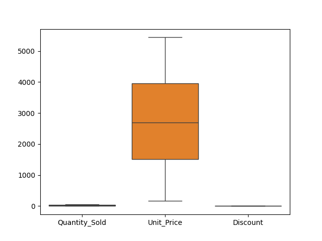
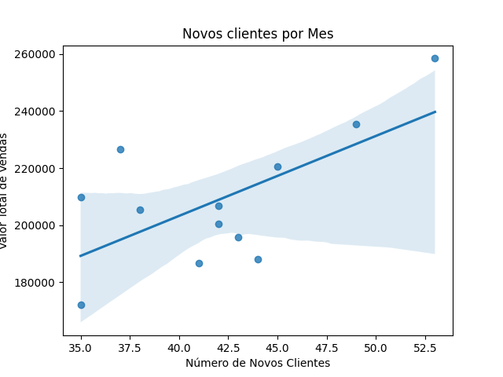
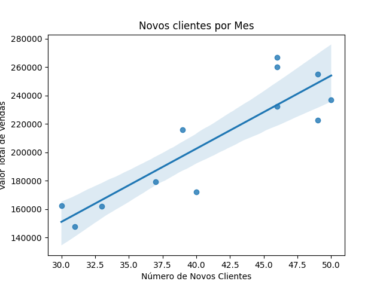

# Análise Exploratória de Dados - Sales Data

Este projeto realiza uma análise exploratória de um conjunto de dados de vendas. O objetivo é analisar o comportamento de vendas com base em diferentes fatores, como região, método de pagamento, tipo de cliente e vendedor, além de verificar a existência de outliers e a distribuição de vendas ao longo do tempo.

## Pré-requisitos

Antes de rodar o código, você precisará garantir que as bibliotecas abaixo estejam instaladas:

- pandas
- seaborn
- matplotlib

Você pode instalar as dependências utilizando o `pip`:

```bash
pip install pandas seaborn matplotlib
```

## Descrição do Código

O código realiza as seguintes etapas:

1. **Leitura do Dataset**
   - O arquivo CSV contendo os dados de vendas é carregado usando o `pandas.read_csv()`.

2. **Análise Descritiva**
   - A função `describe()` é utilizada para exibir estatísticas descritivas dos dados, como mínimo, máximo, média, desvio padrão e quartis.

   `descricao = dados.describe()`

3. **Verificação de Duplicatas e Dados Faltantes**
   - Verifica-se a existência de duplicatas e valores nulos nos dados, utilizando os métodos `duplicated()` e `isnull()`.

   `dados_dup = dados.duplicated().sum()`
   `dados_null = dados.isnull().sum()`

4. **Análise de Outliers**
   - Utiliza-se um boxplot para verificar a existência de outliers nas colunas `Quantity_Sold`, `Unit_Price` e `Discount`.

   

5. **Distribuição de Vendas por Região**
   - Agrupa-se os dados por região (`Region`) e calcula-se o total de vendas para cada uma, visualizando os resultados em um gráfico de barras.
   

   - A maior quantidade de vendas ocorreu na região Norte, enquanto a menor foi na região Sul

6. **Análise de Métodos de Pagamento**
   - Agrupa-se os dados por `Payment_Method` e visualiza-se o total de vendas para cada método de pagamento.

   

   - Os Metodos de pagamentos mais usados foram Cartão de Credito e Transferencias Bancarias

7. **Valor de Vendas por Vendedor** e **Quantidade Vendida por Vendedor**
   - Agrupa-se os dados por `Sales_Rep` e visualiza-se o total de vendas realizadas por cada vendedor.

    
    

    -O valor de venda foi proporcional à quantidade de vendas realizadas por cada vendedor. Isso ocorre porque, caso houvesse variação na proporção de itens mais caros ou mais baratos vendidos, o valor total poderia diferir. Isso indica que a média de vendas entre os vendedores é relativamente constante, sendo mais influenciada pela quantidade de vendas do que pelo valor unitário dos produtos.

8. **Análise de Vendas por Tipo de Cliente (Novo vs Recorrente)**
   - Realiza-se uma comparação entre novos clientes e clientes recorrentes, utilizando boxplots para visualizar as distribuições de vendas.

   

   - Clientes recorrentes ainda geram mais receita do que novos clientes. No entanto, observa-se um crescimento significativo no volume de novos clientes.

9. **Vendas por Mês**
   - Analisa-se a sazonalidade das vendas ao longo do ano.

   
   
   - Os meses com maiores vendas foram janeiro, outubro e novembro, enquanto os de menores vendas foram fevereiro, julho e setembro. No entanto, há uma constância nas vendas ao longo do ano.

10. **Contagem de Novos Clientes por Mês**
   - Identifica-se a distribuição de novos clientes ao longo dos meses.

    

   - Os meses com maior volume de vendas coincidem, em geral, com os meses de maior captação de novos clientes. Isso sugere uma relação entre o crescimento da base de clientes e o aumento no faturamento.

   - Correlação Encontrada: O coeficiente de correlação calculado foi 
    0.6437, indicando uma correlação moderada a forte entre o número de novos clientes e o valor total de vendas por mês.

   - Para melhor compreender essa relação, foi criado um gráfico de dispersão com linha de regressão, demonstrando a tendência positiva entre essas variáveis.

   
   
   
   - Codigo usado para calcular correlação:

   ```python 
   correlation = aggregated['Customer_Count'].corr(aggregated['Total_Sales'])

11. **Análise de Correlação entre Clientes Recorrentes e Valor de Vendas**
   - Durante a análise dos dados de vendas, foi calculada a correlação entre o  número de clientes recorrentes e o valor total de vendas. O valor obtido para a correlação foi de 0.883, o que indica uma correlação muito forte entre essas duas variáveis.

   
   

   - Codigo usado para calcular correlação:

O código usado para calcular a correlação foi:

```python
correlation = aggregated['Customer_Count'].corr(aggregated['Total_Sales'])


   - Esse resultado sugere que, conforme o número de clientes recorrentes aumenta, o valor de vendas também tende a crescer de forma significativa. Isso pode ser um indicativo de que os clientes recorrentes são responsáveis por uma parcela considerável das vendas, o que reforça a importância de estratégias de fidelização de clientes.


# Conclusão

A análise exploratória revelou diversas tendências importantes:

A região Norte teve o maior volume de vendas, enquanto a região Sul teve o menor.

Cartão de crédito e transferência bancária foram os métodos de pagamento mais comuns.

O valor total das vendas seguiu de perto a quantidade de produtos vendidos, sugerindo que o mix de produtos vendidos pelos vendedores foi semelhante.

Clientes recorrentes ainda representam a maior fatia da receita, mas há um crescimento expressivo de novos clientes.

Janeiro, outubro e novembro foram os meses com mais vendas, enquanto fevereiro, julho e setembro tiveram os menores volumes.

O aumento no número de novos clientes está diretamente relacionado aos períodos de maior faturamento.

Essa análise fornece insights valiosos que podem ajudar na definição de estratégias para maximizar o faturamento e expandir a base de clientes ao longo do tempo.

